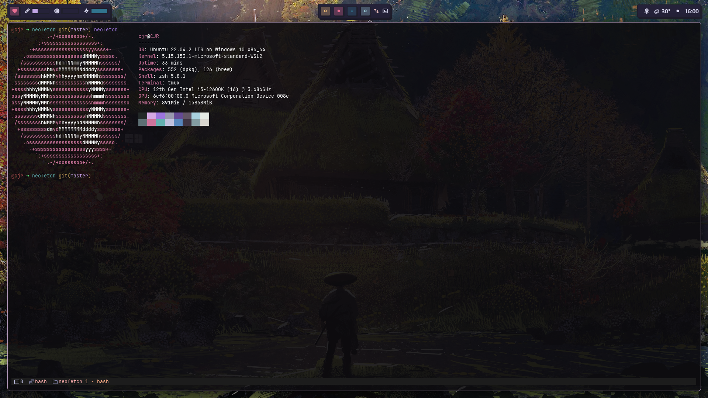

## 🫎 Prerequisites
- `nerdfont` (currently using `UbuntuMono Nerd Font`)
- `brew`
- `zsh`
- `alacritty`
- `Tmux Plugin Manager` 

## 🐭 Commands dump
### Mac
```bash
# Set zsh as default shell
chsh -s $(which zsh)

# Installing
brew bundle --file=~/.nexus/dot/brew/Brewfile

# Exporting brew packages
brew bundle dump

# Removing incorrectly generated symlinks 😰
find ~ -maxdepth 1 -lname 'dot_files/*' -exec echo rm {} \;
find ~ -maxdepth 1 -lname 'dot_files/*' -exec rm {} \;

stow .config -t ~/.config
stow .home -t ~
```
### Windows (Powershell)
```powershell
# Path - where the symbolic link will be 
# Value - Source file
New-Item -Path AppData\Roaming\Code\User\settings.json -Value .\dot\.config\vscode\settings.json -ItemType SymbolicLink 
New-Item -Path .glzr -Value .\dot\.config\.glzr -ItemType SymbolicLink
New-Item -Path .wezterm.lua -Value .\dot\.config\wezterm\wezterm.lua -ItemType SymbolicLink
```

## Paths
| Path   | Description                                               |
|--------|-----------------------------------------------------------|
| VSCode | `AppData\Roaming\Code\User` |

## 🐶 Resources
- https://wiki.archlinux.org/title/XDG_Base_Directory
- https://github.com/rockerBOO/awesome-neovim
- chris@machine Neovim series
- https://learn.microsoft.com/en-us/windows-server/administration/openssh/openssh_server_configuration
