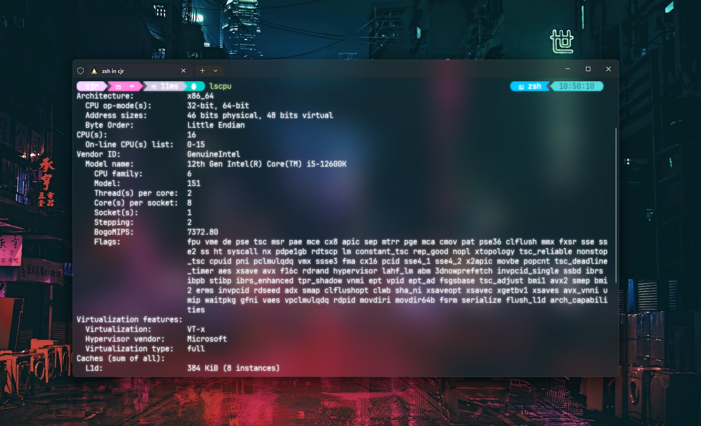

| Module     | Description                                    |
|------------|------------------------------------------------|
| Neovim     | Text editor                                    |
| ZSH        | zsh shell configs                              |
| Fish       | Shell configs                                  |
| .ideavimrc | VIM configuration file for IntelliJ VIM plugin |

## Prerequisites
- Brew
- Nerd-font 
  - For displaying oh-my-posh
  - I'm currently using Jetbrains Mono


## Resources
- https://github.com/rockerBOO/awesome-neovim
- chris@machine Neovim series
- Smart friends (https://github.com/evantancy)
- https://learn.microsoft.com/en-us/windows-server/administration/openssh/openssh_server_configuration

```
New-Item -Path ~\dot_files -ItemType SymbolicLink -Value .\dot_files\
```
